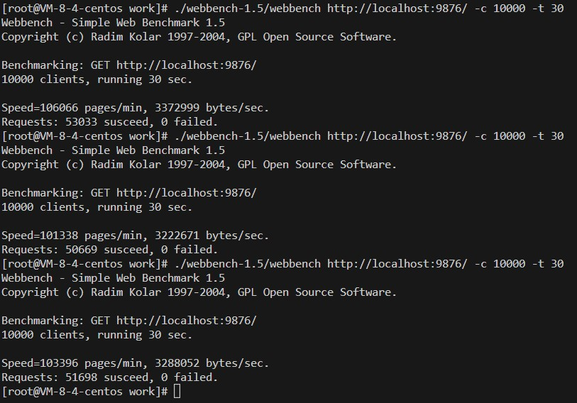

## Linux下轻量级Web服务器

### 项目介绍

基于C++11编写的Web服务器，使用Reactor高并发模型。

- 使用epoll管理HTTP连接，使用ET触发方式；
- 使用了单例模式的MySQL连接池，SQL命令的调用使用RAII风格封装；
- 基于小根堆实现定时器，释放不活跃连接；
- 使用正则表达式解析HTTP请求；
- HTML代码使用Chat-GPT辅助编写。

### 启动

1. `git clone git@github.com:Axope/WebServer_cpp.git`；
2. 在`main.cpp`中修改对应配置信息；
3. 执行build脚本 `sh build.sh`；
4. `./server`启动服务。

### 压力测试

腾讯云轻量应用服务器，4核8GB，使用Webbench进行压力测试，结果如下：

从测试平均结果上来看，1w并发量条件下QPS约1700+

